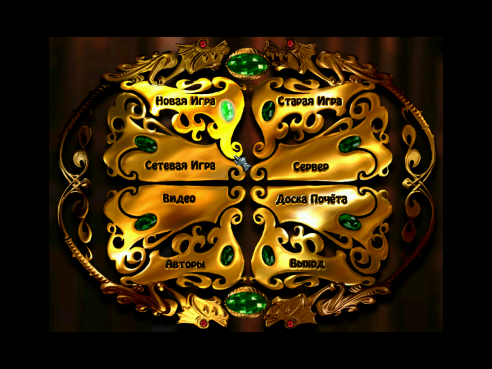

### Introduction

This project was started because I wanted to show my favorite game to my special one. Unfortunately, the game didn't run on latest Windows even in compatibility mode.

### Prepare

You will need to install Scoop package manager (http://scoop.sh) and some packages:
```
scoop uninstall gcc # if installed
scoop install gcc -a 32bit
scoop install cmake
```

You will also need `msvcrt.dll` in order to run applications with this library.

### Build

```
git clone git@github.com:excitoon/ddraw
mkdir ddraw-bin
cd ddraw-bin
cmake ../ddraw/src -G "Unix Makefiles"
make
ctest
```

### Examples

#### Rage of Mages

|  |  |
|:------:|:-----:|
| Before | After |

### See also

* https://github.com/narzoul/DDrawCompat
* https://github.com/DxWnd/DxWnd.reloaded
* https://github.com/hifi/cnc-ddraw
* https://github.com/jarikomppa/dxwrapper
* https://github.com/ToadKing/ddhack
